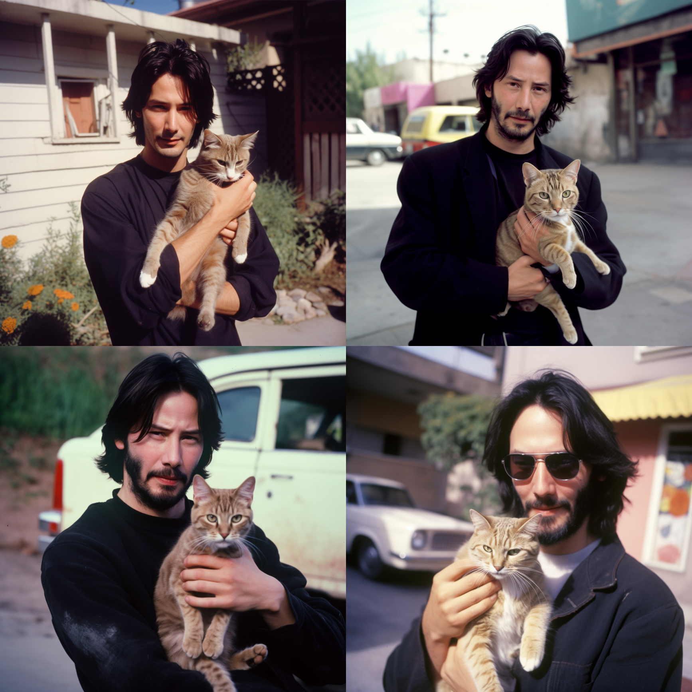
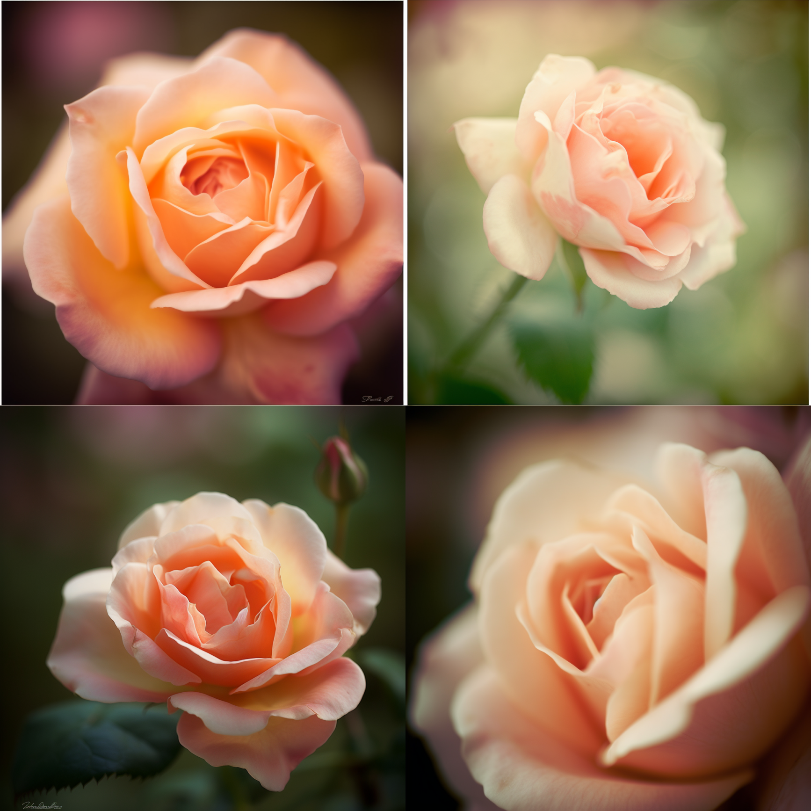

# 场景9：风景

实物和人物介绍完，介绍一下风景。坦率说来，我并不擅长摄影，所以这三章写得可能会不太专业。我更多地是介绍方法，以及告知大家可能性。

如果有不对的地方，请见谅。

## 微缩景观

风景大片，我觉得大家应该都在各大平台看过了，所以本章不会介绍太多常见的风景制作方法。而是介绍一些少见的，我这里介绍一个比较有趣的类型：

|         | **Prompt**        | **解释**                                                                                             |
| ------- | ----------------- | -------------------------------------------------------------------------------------------------- |
| 类型是什么？  | Miniature faking  | 迷你化仿效果（Miniature faking），也称为玩具世界效果，是一种通过特定的拍摄和处理技术来创造出一种缩小的场景感觉的方法。这种技术可以让实际大小的对象看起来像是一些小的塑料或金属模型。 |
| 主体是什么？  | Train Lines       | 火车线路                                                                                               |
| 环境是怎样的？ | null              | 不太重要，就让 AI 自由发挥                                                                                    |
| 构图是怎样的？ | null              | 不太重要，就让 AI 自由发挥                                                                                    |
| 用什么镜头？  | null              | 不太重要，就让 AI 自由发挥                                                                                    |
| 是什么风格？  | style of Japanese | 我想要那种日本火车style，所以加了这个参数                                                                            |

另外还制作了一个火星工厂：

|        | **Prompt**   | **解释** |
| ------ | ------------ | ------ |
| 主体是什么？ | Mars Factory | 火星工厂   |

另外，我还很喜欢用这个效果制作一些多肉植物的照片，主体只要填写：cute mini Haworthia cymbiformis plant in a pot，或者 cute mini Aloe plant in a pot ：

## 建筑

严格说来，这个不算风景，但因为我实在不知道该放哪里，所以还是放到风景这了。

因为我不是建筑相关的从业者，所以我这里只介绍一种用法：对于人造物件，可以在主体里加入由 某某某 制造。以建筑为例，也不需要在 prompt 里加类型：

|        | **Prompt**                            | **解释**                                        |
| ------ | ------------------------------------- | --------------------------------------------- |
| 类型是什么？ | null                                  | 不太重要，就让 AI 自由发挥                               |
| 主体是什么？ | Structure by Dame Zaha Mohammad Hadid | 我的母校香港理工大学设计学院大楼的设计师 Dame Zaha Mohammad Hadid |

右边是 Frank Gehry：

如果你对建筑感兴趣，不妨试试两种风格的建筑融合在一起试试，说不定会碰撞出有意思的设计。

## 技巧十六：改变相机与镜头

前几章节分享了灯光，本章分享下，相机和镜头。

可能有些朋友用过一些手机 App ，它并不像 PS 工具那样，允许你修改图片的白平衡等参数，而是让你体验用旧相机（如胶卷相机）拍照，虽然本质上来说，它也是通过各种参数来模拟当年的相机效果，但的确挺有意思的。

在 Midjourney 里，你也可以通过增加相机或者镜头的名称，从而达到类似的效果。根据我的实验，Midjourney 可以改变以下几类：

1. 相机：支持不同种类的相机，比如运动相机 GoPro
2. 胶卷：比如 8 mm 电影胶卷
3. 镜头：比如 15 mm 镜头
4. 相机设置：比如长曝光、双重曝光
5. 景深 & 焦点：比如深景、浅景，还有消失点

我很喜欢双重曝光的效果，以及长曝光：

不过各位使用时，需要根据自己的场景选择合适的相机和镜头，比如无人机视角，都不太适合拍近物：

|
**照片**
 | **名称**               | **介绍**                         | **适合场景**                                                                                                                                                   |
| ------ | -------------------- | ------------------------------ | ---------------------------------------------------------------------------------------------------------------------------------------------------------- |
|        | GoPro                | 运动相机视角                         | 自拍，或者运动场景                                                                                                                                                  |
|        | Drone                | 无人机视角                          | 适合航拍，或者天空景色                                                                                                                                                |
|        | polaroid             | 宝丽来                            | 应该不需要解释了吧                                                                                                                                                  |
|        | black and white film | 黑白照                            | 应该不需要解释了吧                                                                                                                                                  |
|        | Kodachrome           | 柯达生产的彩色幻灯片底片品牌                 | 具有非常高的颜色鲜艳度、对比度和持久性。                                                                                                                                       |
|        | shot on 8mm          | 电影 8 毫米胶卷是一种便携式、简单易用的胶片，分辨率比较低 | 适用于拍摄家庭和旅游等普通场景                                                                                                                                            |
|        | shot on 16mm         | 电影 16 毫米胶卷                     | 16毫米和35毫米主要用于制作电影、纪录片和商业广告。                                                                                                                                |
|        | shot on 35mm         | 电影 35 毫米胶卷                     | 16毫米和35毫米主要用于制作电影、纪录片和商业广告。                                                                                                                                |
|        | Microscopic          | 显微镜                            | 适合一些需要放大观察的实物                                                                                                                                              |
|        | Fisheye Lens         | 鱼眼镜头                           | 鱼眼镜头可以将整个场景拍摄在一个范围内，这种镜头的视角通常在 100° 至 180° 之间，可以呈现出非常夸张的透视效果。                                                                                              |
|        | Wide Angle           | 广角镜头                           | 适合风景照，可以让画面容纳更多内容                                                                                                                                          |
|        | Ultra-Wide Angle     | 超广镜头                           | 适合风景照，可以让画面容纳更多内容                                                                                                                                          |
|        | Panorama             | 全景                             | 适合风景照，可以让画面容纳更多内容                                                                                                                                          |
|        | Short Exposure       | 短曝光                            | 通常用于追拍运动员、表演者或动物等，或者是拍摄需要快速决定瞬间捕捉的场景，例如拍摄火车、汽车、快速移动的车辆等。由于短曝光时间的限制，这种方式可以冻结运动物体并防止出现模糊的情况。                                                                 |
|        | Long Exposure        | 长曝光                            | 在长曝光的拍摄中，快速移动的物体会出现轨迹，例如流星、车灯、瀑布等，这种方式会给照片创造出愉悦而神秘的氛围。此外，长曝光可以用于拍摄夜晚的大片景象，例如景色、城市夜景、星空等。                                                                   |
|        | Double Exposure      | 双重曝光                           | 双重曝光的技术，可以创造出疏密有致和扭曲的、手绘和黑白艺术风格的照片。这种技术在拍摄人像、风景和建筑等领域十分受欢迎，因为它可以创造出独特的环境、浪漫和奇异感觉的图像。                                                                       |
|        | f2.8                 | 2.8 光圈                         | 在拍摄时，光圈值越大，相应的光线进入相机的量就越大，使得相机所获得的图像更亮。f:2.8 的值是一个比较大的光圈值，因此镜头具有很高的传光能力，适合在低光环境中使用。同时，在大光圈下可以创造出较小的景深效果，突出焦点主题而模糊背景或前景，从而产生轻柔的背景效果，适合拍摄人物肖像或商品照片等类似主题。 |
|        | Depth of Field       | 景深                             | 是指在摄影中，被拍摄的画面中被认为是清晰的范围，也称为焦距深度区域，通常用来描述在照片中被认为是清晰的范围。                                                                                                     |
|        | Soft Focus           | 柔焦                             | 指将相机镜头前加入一层特殊的滤镜，使被拍摄的主体轻微模糊以呈现柔和的美感效果。柔焦的视觉效果相较于深景和浅景来说更强调画面的情感主题，把重点集中在逐渐化解结构感的质感效果上，使它在照片上产生一种有点朦胧的妆容，刻画出一幅浪漫的画面。                                       |
|        | Deep Focus           | 深焦                             | 将摄像头在一个较大的光圈下设置，保持整个画面都清晰锐利的技术。深景通常需要使用较小的焦距或较远的拍摄距离，以保持整个画面的清晰度，是类似于大景深的一种刻画效果。                                                                           |
|        | Shallow Focus        | 浅焦                             | 将相机的光圈调整到一个相对较大的开口，以使摄影师可以根据需要保持相机在平面上的一个特定区域或主体清晰，而照片中的其他区域则变得模糊不清的技术。这种效果常用于摄影肖像，使人物在画面上的清晰度突出，并且画面背景透露轻微的模糊感，带来更具艺术美感的效果。                               |
|        | Vanishing Point      | 消失点                            | 消失点指的是位于无穷远处，用于视觉处理的一点。在透视绘画中，我们可以想象一个位于无穷远处的点，使得所有线条都向它聚拢。消失点可以帮助画家或摄影师达到精致的透视处理效果，从而创造出独特的空间感；                                                           |
|        | Vantage Point        | 俯瞰视角                           | 一般呈现的效果是照片中会有一个点是最高点，然后在此最高点斜上方拍摄                                                                                                                          |

